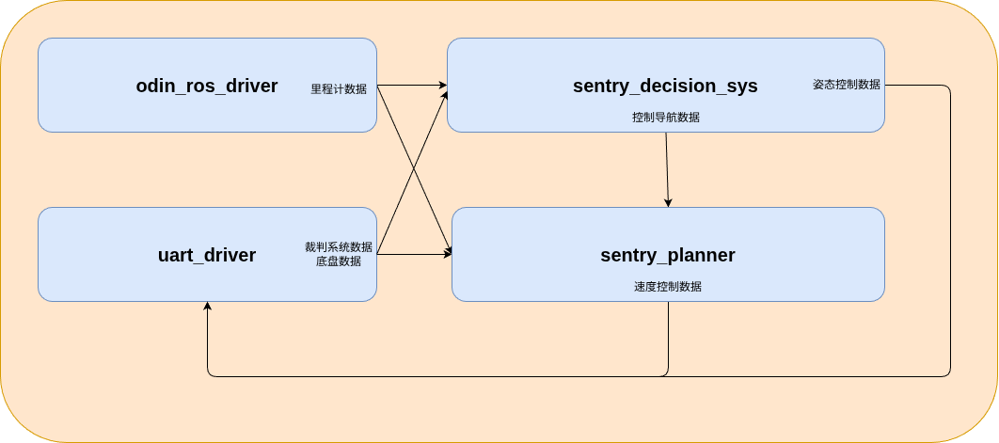

# SentryMaster2026 工作空间

### 1.官方提供环境（不用去修改）
- **odin_ros_driver** Odin1空间感知模块驱动节点，会输出一个固定的里程计话题，里面包含了Odin1原点坐标系下机器人相对于启动点的位姿信息。同时Odin1还会输出原始的点云、IMU和图像数据。

- **sentry_launch** 启动脚本功能包，启动时会自动启动所有需要的模块，同时会创建Odin1到机器人中心坐标系的坐标变换发布，每个功能包的参数在模块对应的功能包内的config/文件夹下，不需要在启动脚本功能包下修改。

- **场地地图** 在sentry_planner下有一个/map文件夹，里面包含场地的点云地图和2D投影地图，可以直接作为导航地图使用。

- **部分框架**
    - rm_msgs 的裁判系统数据、底盘数据 ROS2 msg 接口
    - sentry_planner 的接收者部分，会自动接收里程计和裁判系统 topic 数据
    - sentry_decision 的接收者部分，会自动接收里程计、裁判系统数据和底盘 topic 数据
    - uart_driver 的发布者部分，会自动接收来自电控的底盘和裁判系统 USB 数据，然后转发成ROS2 topic数据

### 2.需要完成
**需求分析**
- 根据比赛规则，分析哨兵机器人需要完成什么任务，每个任务由哪几个基本的控制接口组成，哪个节点负责得出什么控制指令

**rm_msgs**
- 决策节点给 **导航节点** 发布控制指令的 ROS2 msg 接口
- 导航节点给 **USB 驱动节点** 发布速度控制指令的 ROS2 msg 接口
- 决策节点给 **USB 驱动节点** 发布姿态控制指令的 ROS2 msg 接口

**uart_driver**
- 接收导航节点和决策节点的 ROS2 topic 数据的接收者 
- 将接收到的 topic 数据整合到一个给定的**ChassisControl**结构体中，然后发送给电控，发送方式参考该功能包下的struct_def.hpp文件

**sentry_decision_sys** 
- 处理接收者收到的里程计、底盘、裁判系统数据
- 自行设计决策算法给导航节点和 USB 驱动节点发布 ROS2 topic 数据

**sentry_planner** 导航节点功能包
- 处理接收者收到的里程计、底盘、决策数据
- 自行设计导航算法给 USB 驱动节点发布 ROS2 topic 数据

### 3.整体数据流

### 4.启动方式
- 命令行进入 scripts/ 文件夹下面，输入 `bash build.sh` 一键编译所有节点，输入 `bash chassis.sh`一键启动所有节点

### 5.注意事项
本工作空间不代表最终比赛版本，请使用 **git** 创建新的分支，然后再进行比赛代码开发。工作空间的补丁（一般是上述第一大点中内容的修补，不会影响需要参赛人开发的内容）都会通过 GitHub 仓库 **main** 分支进行同步，如果因为 git 操作失误导致不能同步到最新比赛版本的后果自负